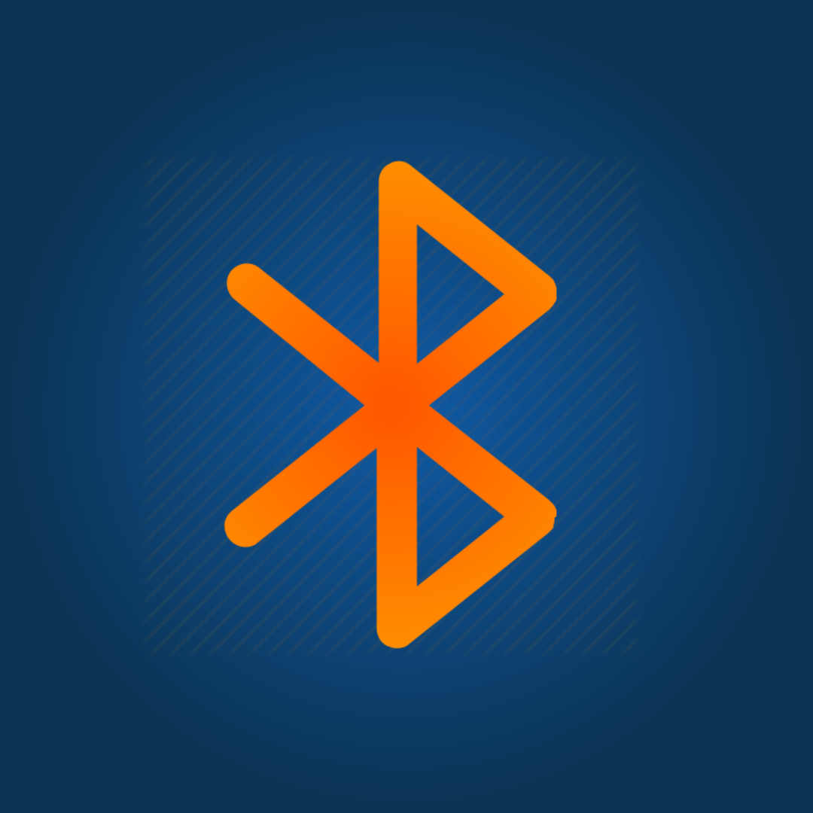
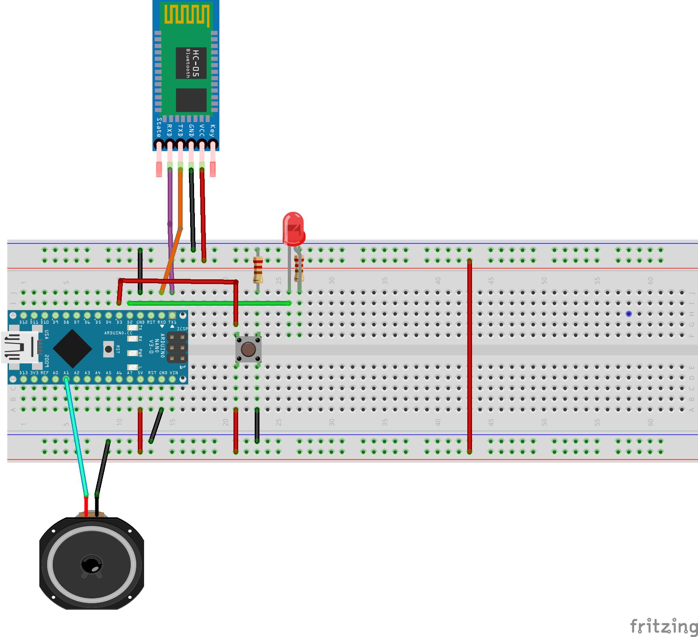

# Bluetooth-Buddy
iOS Arduino "lock" controller app
[watch the demo!](https://youtu.be/lb7JIeWQx84)

# Hardware
* Mac with xCode installed 
* iOS device & connecting cable
* Arduino with serial (or one that can use the software serial library)
* Bluetooth serial module 

[Here's what I used!](http://a.co/5BkcDCX)

# Software
* [xCode](https://developer.apple.com/xcode/)
* [Arduino IDE](https://www.arduino.cc/en/Main/Software)

# Arduino Overview
The arduino code contains two arrays that are indexed together to map a users login code to a name. Then it Serial.prints out a result and the iOS device is listening for data from the arduino. The arduino is always listening for serial data to read and react to in its loop. Other events like checking on the client are scheduled using the timer library.

[Timer Library](https://github.com/contrem/arduino-timer)

# iOS App Overview
The iOS app in this project is a single page app written with swift. It uses corebluetooth to discover bluetooth 'periferals'. Once you find a periferial you need to scan it for characteristics. I have attached the documentation for the bluetooth module I used. This characteristic is where we will write messages as strings and share them over bluetooth!

[Core Bluetooth Docs](https://developer.apple.com/bluetooth/)

# Custom 'Protocol'
Code | Responses - Results
--- | --- 
`200` | `Locked or Unlocked`
`250` | `String with the users name`
`300` | `No msg, just asking the client if they are still active`
`default` | `No action`

# How do I wire this up?

